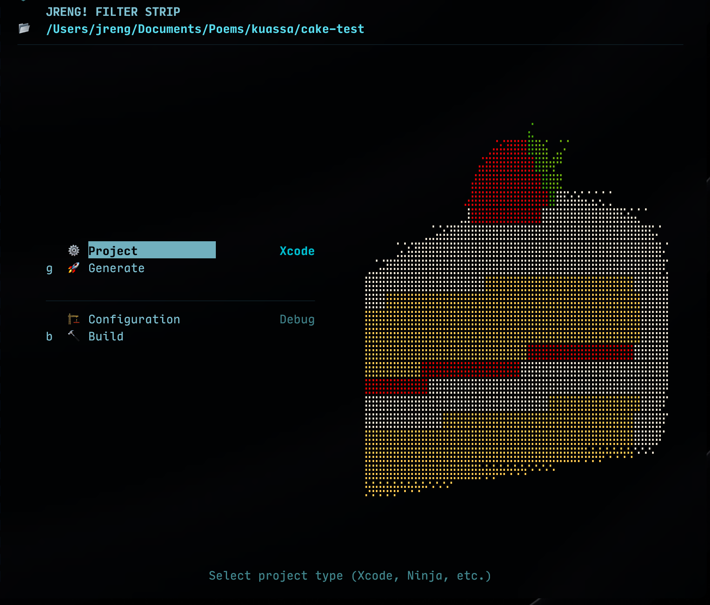

<div align="center">
  
</div>

# CAKE — CMake Project Manager

I'm lazy.

Typing `cmake -S . -B Builds/Xcode -G Xcode` every time is tedious. So i made TUI that shows exactly what's possible based on actual build state. One keypress to generate, build, clean, or open IDE.

**If it's in the menu, it works. Period.**


## CAKE Kicks cmake's Ass 

**✅ Zero-Surprise Guarantee**  
CAKE analyzes your project state first, then builds the menu. If an action appears, it will succeed. No more `error: build directory not configured` after you spend time waiting for compilation.

**🚀 Smart Generator Detection**  
While others require manual setup, CAKE detects available generators automatically. Xcode, Ninja, Visual Studio—if it's installed, it's available.

**📂 Clean Build Structure**  
Strict `Builds/<Generator>/` convention. VS2026, VS2022, Xcode, Ninja—each gets its own directory. No confusion about which build is which.

**🔧 One-Key Operations**  
Generate, Build, Clean, Open IDE—all single keypress. No typing `cmake -S . -B Builds/Xcode -G Xcode`. Just press `g`.

**🎨 Seasonal Themes**  
5 built-in themes including Spring, Summer, Autumn, Winter. Meticulously hand picked color palette that would be a sight for sore eyes.
```
~/.config/cake/themes/

add your own, select from config menu. shortcut / 
```

**⚡ Real-Time Output**  
Watch CMake and compiler output stream live. No waiting for completion to see what's happening.

**🔄 Auto-Scan**  
Background project state detection keeps CAKE current. Menu updates when builds appear or disappear.

**💪 Multi-Config Support**  
All generators use multi-config builds. Debug and Release in the same build directory. Switch configurations instantly.


## Get Started

```bash
./build.sh
./cake
```

**Requirements:** Go 1.21+, CMake, Terminal (70×24 minimum)


## Rock 'n Roll Workflow

**Start anywhere:** CAKE works in any directory with CMakeLists.txt.

**See what's possible:** Menu shows only actions that will succeed.

**Generate once:** Pick your generator, press `g`, watch it configure.

**Build fast:** Press `b`, watch compiler output stream live.

**Open IDE:** Press `o`, Xcode or Visual Studio launches instantly.

**Clean slate:** Press `c`, build directory gone. Start fresh.


## Navigation

| Key | Action |
|-----|--------|
| `↑/k` `↓/j` | Navigate |
| `Enter` | Execute (always works) |
| `g` | Generate/Regenerate |
| `b` | Build |
| `c` | Clean |
| `o` | Open IDE |
| `Esc` | Back/Cancel |
| `Ctrl+C` | Exit (press twice) |
| `/` | Preferences |


## Generators

| Generator | Directory | Platform |
|-----------|-----------|----------|
| Xcode | `Builds/Xcode/` | macOS |
| Ninja | `Builds/Ninja/` | All |
| Visual Studio 2026 | `Builds/VS2026/` | Windows |
| Visual Studio 2022 | `Builds/VS2022/` | Windows |


## For Developers

**Built with:** Go + Bubble Tea + Lip Gloss  
**Architecture:** State-driven Model-View-Update (Elm pattern)  
**No dependencies:** Single static binary  
**Config:** `~/.config/cake/config.toml`

**Documentation:**
- [SPEC.md](SPEC.md) — Complete technical specification
- [ARCHITECTURE.md](ARCHITECTURE.md) — System design

**Key patterns:**
- Generator detection via system tools
- Multi-config build path convention
- Real-time output streaming
- Preference-style menu (TIT pattern)


## License

MIT — Use it, break it, fix it, ship it.

---

<div align="center">
  
</div>

**CAKE: a piece of cake. Because CMake shouldn't be hard.**

---
Rock 'n Roll!

**JRENG!** 🎸
---
conceived with [CAROL](https://github.com/jrengmusic/carol)
